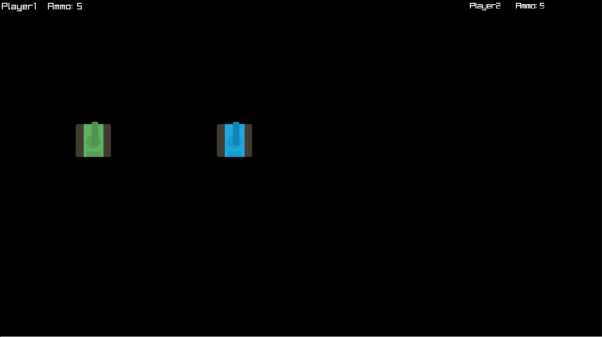

# Projects

## Two player tank game
Multiplayer tank combat game

[Repository](https://github.com/seaneastin/Two-player-tank-game)

[Latest Release](https://github.com/seaneastin/Two-player-tank-game/releases)

## Pong

[Repository](https://github.com/seaneastin/Pong)

[Web Player](https://seaneastin.github.io/Pong/player/)

## Pinball
Pinball game that demonstrates physics.

[Repository](https://github.com/seaneastin/Pinball)

[Latest release](https://github.com/seaneastin/Pinball/releases)

## Vapor Space
Arcade-style shoot ‘em up in a vapor wave setting.

[Repository](https://github.com/seaneastin/Vapor-Space)

[Itch](https://team-elec.itch.io/vapor-space)

## Torn
Grapple around floating islands to find crystals to stop the islands from  being torn apart

[itch](https://team-light.itch.io/torn)
